# Wireshark Packet Analysis

## Table of Contents

1. [Project Description](#project-description)
2. [Configuration](#configuration)
3. [Implementation Steps](#implementation-steps)
4. [Skills Acquired](#skills-acquired)
5. [Additional Resources](#additional-information)

## Project Description

Main goal of the project is to gain a hands-on experience with Wireshark. During the work I anaized network traffic using pcapng files from David Bombal Wireshark course on youtube. I've learnt many Wireshark features, got better understanding of how network traffic flows, how important securing data is and also explored network protocols deeper.

###### Project is on-going because I'm still learning more and more about Wireshark and packet analysis.

## Configuration

### Tools and Software Used

- Wireshark
- Pcapng files - simulated traffic

## Implementation Steps

1. **VoIP traffic:**
    - Captured Skinny (SCCP) protocol traffic which facilitates communication between VoIP devices and a call control unit.
    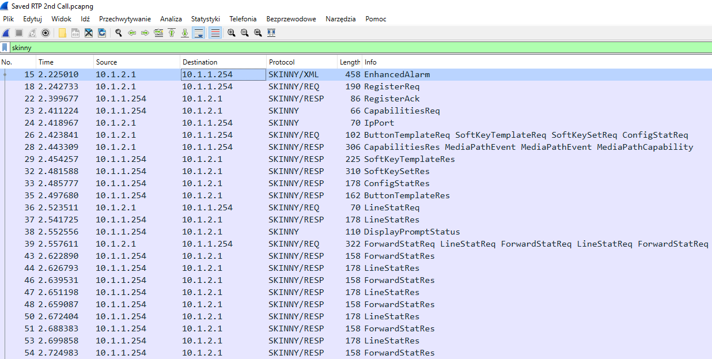
    - Also found RTP (Real-Time Transport Protocol) which delivers audio and video over IP networks.
    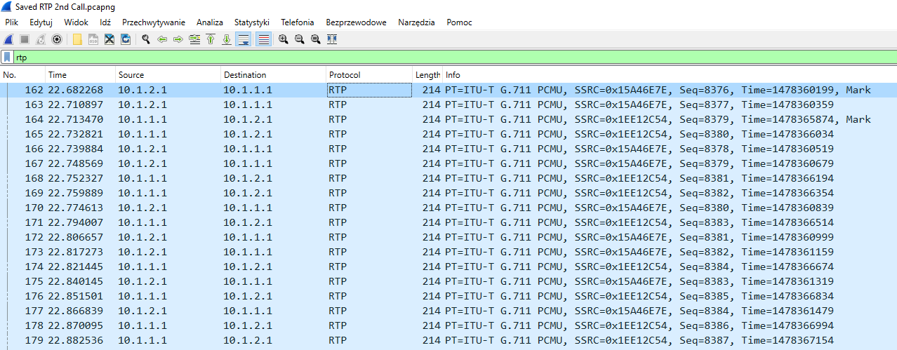
    - Then I looked at RTP streams where I found two IP phones that were communicating.
    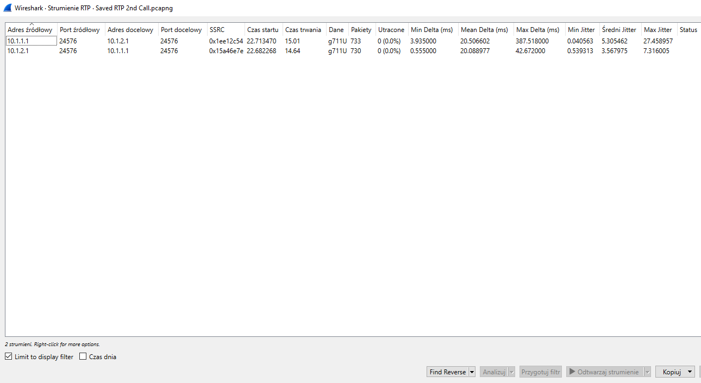
    - I analized one of the two streams and I could replay audio of the conversation.
    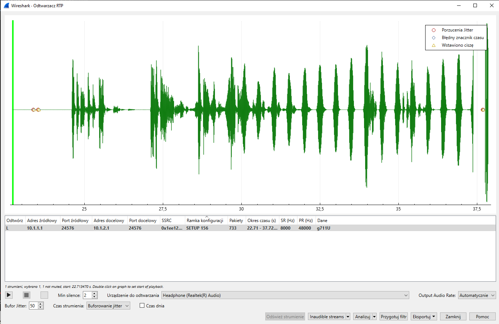

        This shows how dangerous capturing packets can be. There is possibility to replay whole conversation that could appear to be safe but in reality wasn't.
---
2. **HTTP traffic:**
    - Captured Skinny HTTP traffic between Client and Server.
    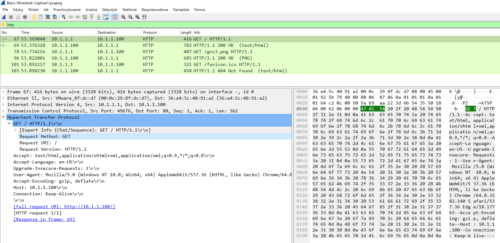
    - First message was HTTP GET to ask server for resources, to which server replied with response status 200 OK.
    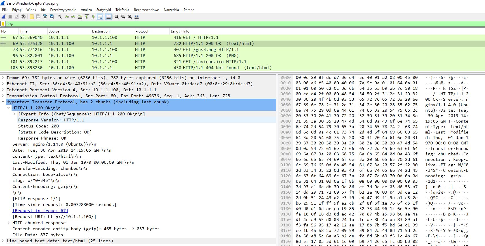
    - This shows why HTTP shouldn't be used over Internet because everything is sent in plain text which can be easily captured. For example we can see whole html:
    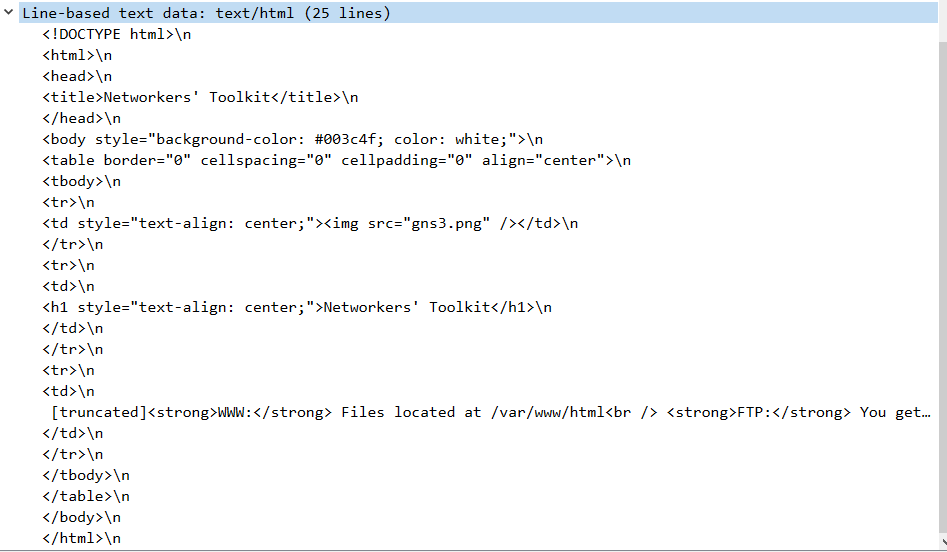
    - On site there is png image that Client ask with HTTP GET, to which server replies with image. We can easily export bytes of packet and recreate the image from captured packet.
    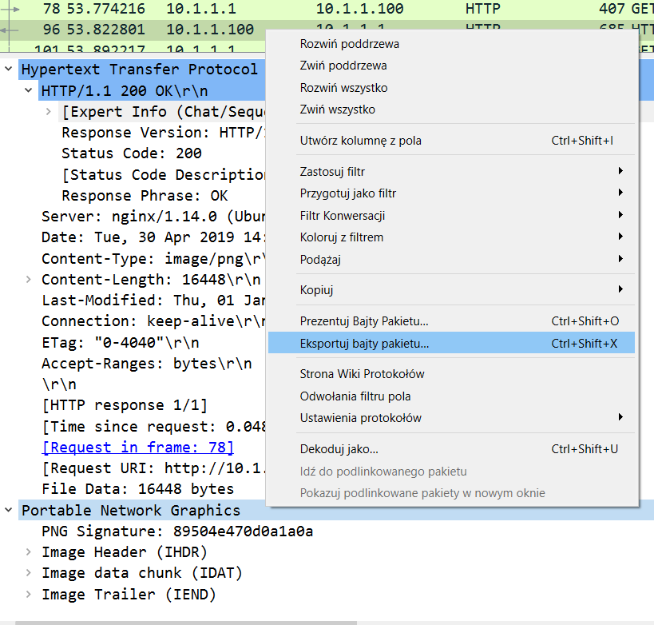

        This is perfect example of why HTTP shouldn't be used because it isn't a secure protocol which is caused by lack of encryption.
---
3. **Telnet traffic:**
    - Captured Telnet traffic to Cisco router, we can see contents of telnet packet.
    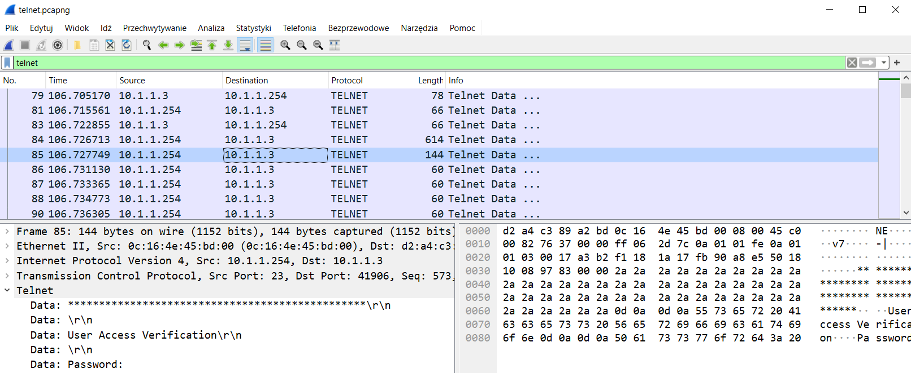
    - I used Wireshark featured to follow TCP stream in order to have better display of content.
    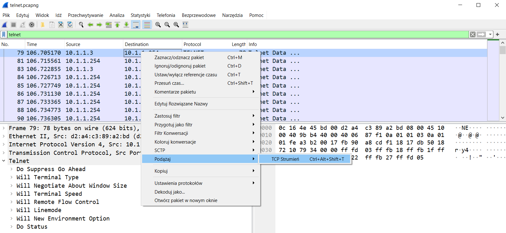
    - Blue color means packets from server and red one packets from client.
    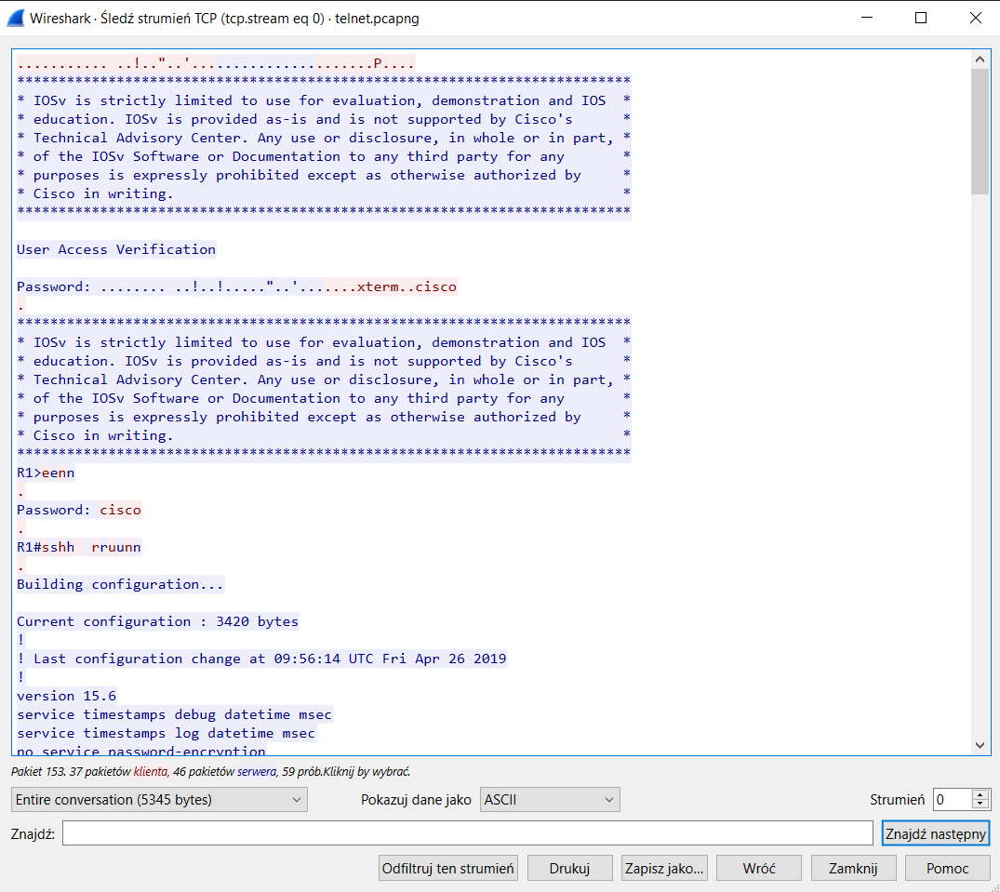

        This shows how dangerous telnet is because like HTTP it sends packets without encryption (in plain text) so it can be easily captured by an bad actor. In this example we can see passwords and even full running configuration of device.
---
4. **HTTPS traffic:**
    - Captured HTTPS traffic, that with no surprise is encrypted.
    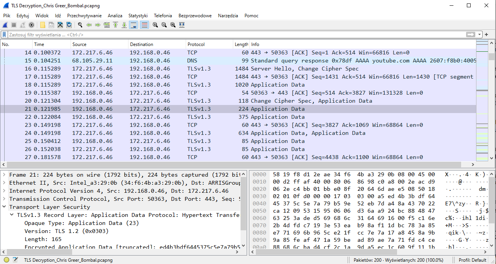
    - I will apply conversation filter to get packets only between two specific endpoints.
    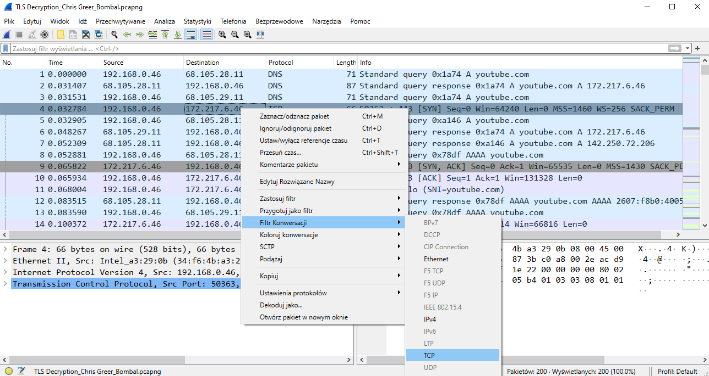
    - Now I can see traffic better, actually this traffic is trying to access youtube.com from web browser, however as we can see traffic is encrypted.
    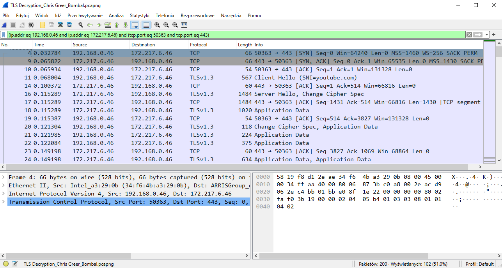
    - TLS works in a way that two endpoints communicating don't have to send keys over internet to establish those keys so it is not easy to capture and also it changes keys for every tcp session. To further analize traffic I got file with TLS keys that system stored on a device after telling him to do so.
    - Using that file I can apply preferences in Wireshark in order to decrypt TLS
    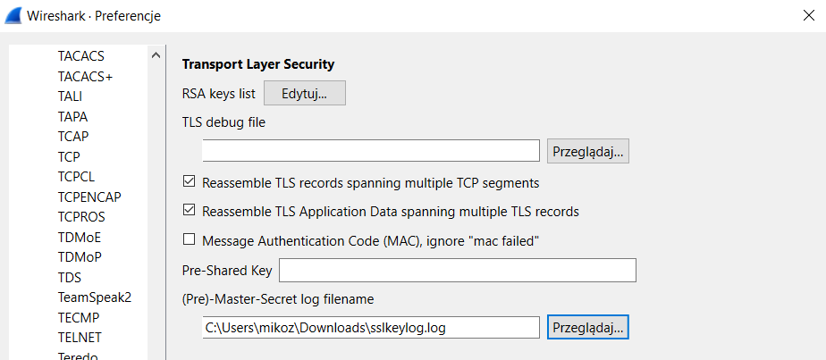
    - Now we can see decrypted traffic, it is using HTTP2
    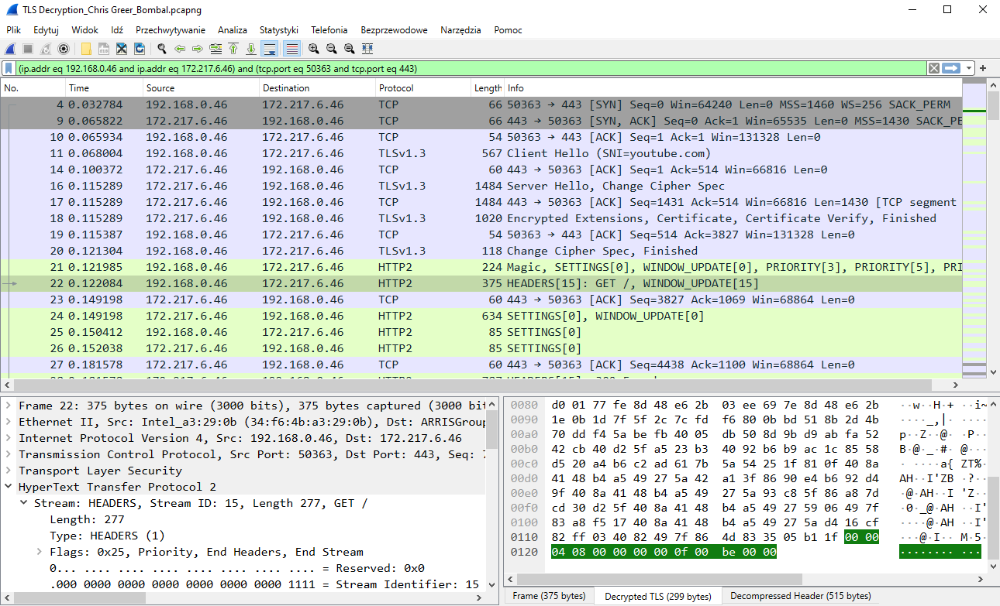
    - Something interesting about this is that we can see GET http2 packet with streamid eq 15. When we search for another http2 packet with streamid eq 15 we can see 302 found. In this packet we can find alt-svc header which is basically asking: "can we now communicate over quic". This protocol is based on udp and was created by google to remove unnecessary traffic which is in tcp.
    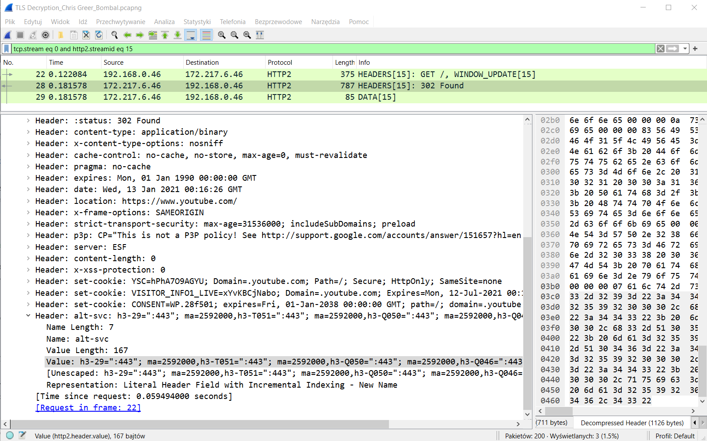

        Analazing real traffic is really complex task because nowadays we have many different protocols, encryption everywhere (which is good because of security reasons). Thanks to this I realized how much there is to explore in this field so I am even more motivated to study more.

## Skills Acquired

Through the implementation of this project, I acquired the following skills:
  - Using Wireshark features like filters, streams, decryption etc for packet analysis.
  - Able to capture and analyze various types of network traffic.
  - Became aware of the importance of securing data transmitted over networks.
  - Recognized vulnerabilities in protocols transmitting data in plain text.
  - Explored various network protocols in depth, including VoIP, HTTP, Telnet, FTP/TFTP and HTTPS/TLS.
  - Deeper understanding of how different protocols function.
  - Learned to follow TCP streams in Wireshark for better visualization and understanding of data transmission.
  - Gained insights into encryption mechanisms, particularly with HTTPS/TLS traffic.
  - Learned to decrypt TLS traffic for analysis.

## Additional Information

- David Bombal YouTube Channel: [link](https://www.youtube.com/@davidbombal)
